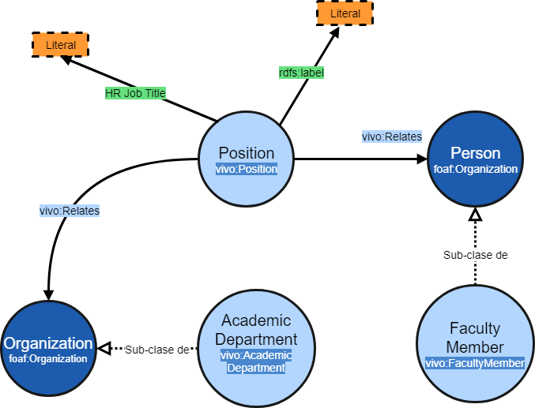

# REPORTE DE INVESTIGADORES POR DEPENDENCIA
Reporte detallado sobre los investigadores de cada dependencia de la UASLP, así como las actividades, nombramientos y reconocimientos de estos.

**Este reporte contempla:**

* a) Cuántos y quiénes son
* b) Cuántos y quiénes son: PTC, Técnicos académicos, Responsables de laboratorios, etc.
* c) Cuántos y quiénes son: SNI por niveles (Positions)
* d) Cuántos y quiénes tienen Perfil Preferencial Prodep (Positions)
* e) Investigadores por áreas temáticas (Apartado research áreas)
* f) Cuántos y quiénes son maestros de postgrado  y en qué programas imparten materias
* g) Cuántos y quiénes han dirigido cuáles tesis
* h) Cuántos y quiénes han recibido distinciones (premios, reconocimientos, etc.)
* i) Cuántos y quiénes han organizado o asistido a cursos, conferencias, tallereres, ect.


Para elaborar el reporte se elaboraron consultas en SPARQL para obtener los datos desde el sistema orbis (VIVO). Las consultas utilizados son:

* Dependencias 
* Investigadores Por Dependencia (a, b)
* Investigadores SNI (c)
* Investigadores PRODEP (d)
* Áreas Investigadores (e)
* Investigadores Imparten Posgrados (f)
* Investigadores dirigen Tesis (g)
* Premios Investigadores (h)
* Investigadores Eventos (i)


:warning: El texto **[URI_DEPENDENCIA]**  que aparece en algunas consultas deberá ser remplazado por la **URI** especifica de la dependencia al momento de ejecutar la consulta, mientras tanto de deja indicado para identificarlo.

## Consulta Dependencias

Consulta sencilla para traer las URI's de las dependencias, este URI se usará en otras consultas para traer los datos de los investigadores de cada dependencia.

```sparql
SELECT  ?dependencia ?nombre
WHERE {

  # Trae el URI y el nombre de cada recurso del tipo "AcademicDepartment"
  ?dependencia a vivo:AcademicDepartment.
  ?dependencia  rdfs:label ?nombre
     
}
 ``` 

## Consulta Investigadores Por Dependencia
Obtiene el nombre y nombramiento de todos los investigadores de una dependencia dada
```sparql
SELECT  DISTINCT ?NombreInvestigador ?Puesto

WHERE {

# Todos los recursos de la clase "Position" que se relacionan con la dependencia
?Positions a  vivo:Position;
vivo:relates [URI_DEPENDENCIA].
  
# Todas las tripletas en las que la Posicion se relacionen mediante la propiedad "relates"
?Positions vivo:relates ?Relacion.

# De las tripletas anteriores, todas aquellas en la que la clase relacionada sea "FacultyMember"
?Relacion a  vivo:FacultyMember.

# Se obtiene el nombre del investigador de la propiedad "label"
?Relacion rdfs:label ?NombreInvestigador.

# Se obtiene el nombramiento asignado en la Posicion
?Positions rdfs:label ?Puesto.

}
```
## Consulta Investigadores SNI
Obtiene el nombre del investigador y el puesto ( "Position") de los investigadores SNI de una dependencia dada. Por ejemplo SNI Nivel 1, SNI Nivel 2. Etc.


### Los nodos involucrados en esta consulta y sus relaciones



``` sparql
 
SELECT  DISTINCT ?NombreInvestigador ?Puesto
WHERE 

# 1.  Se obtienen las posiciones de la dependencia y las de la SEP

#Todos los recursos de la clase "Position" que se relacionan con la dependencia.  
?Positions a vivo:Position;
            vivo:relates [URI_DEPENDENCIA].
   
#Todos los recursos de la clase "Position" relacionados con la URI de la SEP
?PositionsSNI a vivo:Position;
            vivo:relates  <http://orbis.uaslp.mx/vivo/individual/n3332>.

# 2.- Se obtienen todos los investigadores relacionados con la dependencia

#Todas las tripletas en las que la Posicion en la dependencia 
#se relacionen mediante la propiedad "relates"
?Positions vivo:relates ?Investigador.

#De las tripletas anteriores, todas aquellas en la que la clase relacionada 
# sea"FacultyMember" 
?Investigador a vivo:FacultyMember.

# 3.- Se Hace la relacion de los investigadores con las "Positions" de la SEP

#Las tripletas en la que la URI de la SEP se relacione con alguno de los investigadores
# ?PositionsSNI vivo:relates ?Investigador.

# 4.- Se vacian el nombre y puesto en las variables que regresará la consulta

#Se obtiene el nombre del investigador de la propiedad "label"
?Investigador rdfs:label ?NombreInvestigador.

#Se obtiene el nombramiento asignado en la Posicion
?PositionsSNI rdfs:label ?Puesto.	

}
```
## Consulta Investigadores PRODEP
Obtiene los nombres de los investigadores de una dependencia dada que tienen perfil PRODEP.

```sparql
SELECT  DISTINCT ?NombreInvestigador ?Puesto

WHERE { 

# 1 .- Se obtienen las posiciones de la dependencia y las de la SEP

# Todos los recursos de la clase "Position" que se relacionan con la dependencia
?Positions a  vivo:Position;
	vivo:relates [URI_DEPENDENCIA].

#Todos los recursos de la clase "Position" relacionados con la URI de la SEP
?PositionsSNI a  vivo:Position;
vivo:relates  <http://orbis.uaslp.mx/vivo/individual/n2891>.  

# 2.- Se obtienen todos los investigadores relacionados con la dependencia
  
# Todas las tripletas en las que la Posicion en la dependencia se relacionen 
# mediante la propiedad "relates"
?Positions vivo:relates ?Investigador.

# De las tripletas anteriores, todas aquellas en la que la clase relacionada sea "FacultyMember"
?Investigador a  vivo:FacultyMember. 
  
# 3.- Se Hace la relacion de los investigadores con las "Positions" de la SEP

# Las tripletas en la que la URI de la SEP se relacione con alguno de los investigadores
?PositionsSNI vivo:relates ?Investigador.
  
# 4.- Se vacian el nombre y puesto en las variables que regresará la consulta

# Se obtiene el nombre del investigador de la propiedad "label"
?Investigador rdfs:label ?NombreInvestigador.

# Se obtiene el nombramiento asignado en la Posicion
?PositionsSNI rdfs:label ?Puesto.

}
```
