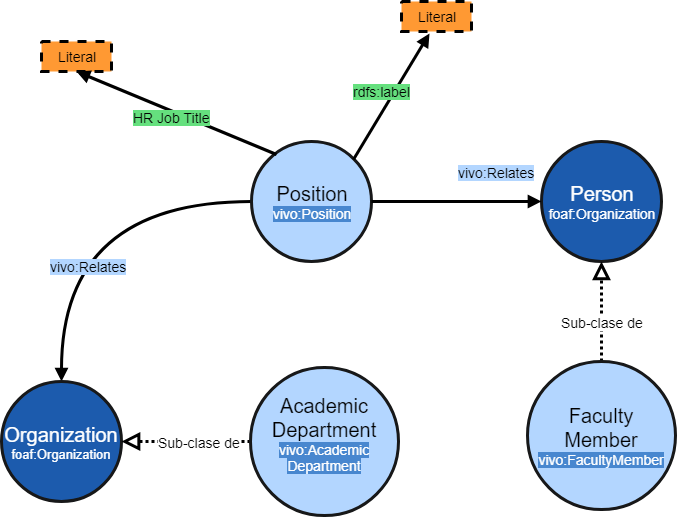

# REPORTE DE INVESTIGADORES POR DEPENDENCIA
Reporte detallado sobre los investigadores de cada dependencia de la UASLP, así como las actividades, nombramientos y reconocimientos de estos.

**Este reporte contempla:**

* a) Cuántos y quiénes son
* b) Cuántos y quiénes son: PTC, Técnicos académicos, Responsables de laboratorios, etc.
* c) Cuántos y quiénes son: SNI por niveles (Positions)
* d) Cuántos y quiénes tienen Perfil Preferencial Prodep (Positions)
* e) Investigadores por áreas temáticas (Apartado research áreas)
* f) Cuántos y quiénes son maestros de postgrado  y en qué programas imparten materias
* g) Cuántos y quiénes han dirigido cuáles tesis
* h) Cuántos y quiénes han recibido distinciones (premios, reconocimientos, etc.)
* i) Cuántos y quiénes han organizado o asistido a cursos, conferencias, tallereres, ect.


Para elaborar el reporte se elaboraron consultas en SPARQL para obtener los datos desde el sistema orbis (VIVO). Las consultas utilizados son:

* Dependencias 
* Investigadores Por Dependencia (a, b)
* Investigadores SNI (c)
* Investigadores PRODEP (d)
* Áreas Investigadores (e)
* Investigadores Imparten Posgrados (f)
* Investigadores dirigen Tesis (g)
* Premios Investigadores (h)
* Investigadores Eventos (i)


:warning: El texto **[URI_DEPENDENCIA]**  que aparece en algunas consultas deberá ser remplazado por la **URI** especifica de la dependencia al momento de ejecutar la consulta, mientras tanto de deja indicado para identificarlo.

## Consulta Dependencias

Consulta sencilla para traer las URI's de las dependencias, este URI se usará en otras consultas para traer los datos de los investigadores de cada dependencia.

```sparql
SELECT  ?dependencia ?nombre
WHERE {

  # Trae el URI y el nombre de cada recurso del tipo "AcademicDepartment"
  ?dependencia a vivo:AcademicDepartment.
  ?dependencia  rdfs:label ?nombre
     
}
 ``` 

## Consulta Investigadores Por Dependencia
Obtiene el nombre y nombramiento de todos los investigadores de una dependencia dada
```sparql
SELECT  DISTINCT ?NombreInvestigador ?Puesto

WHERE {

# Todos los recursos de la clase "Position" que se relacionan con la dependencia
?Positions a  vivo:Position;
vivo:relates [URI_DEPENDENCIA].
  
# Todas las tripletas en las que la Posicion se relacionen mediante la propiedad "relates"
?Positions vivo:relates ?Relacion.

# De las tripletas anteriores, todas aquellas en la que la clase relacionada sea "FacultyMember"
?Relacion a  vivo:FacultyMember.

# Se obtiene el nombre del investigador de la propiedad "label"
?Relacion rdfs:label ?NombreInvestigador.

# Se obtiene el nombramiento asignado en la Posicion
?Positions rdfs:label ?Puesto.

}
```
## Consulta Investigadores SNI
Obtiene el nombre del investigador y el puesto ( "Position") de los investigadores SNI de una dependencia dada. Por ejemplo SNI Nivel 1, SNI Nivel 2. Etc.


### Los nodos involucrados en esta consulta y sus relaciones



``` sparql
 
SELECT  DISTINCT ?NombreInvestigador ?Puesto
WHERE 

# 1.  Se obtienen las posiciones de la dependencia y las de la SEP

#Todos los recursos de la clase "Position" que se relacionan con la dependencia.  
?Positions a vivo:Position;
            vivo:relates [URI_DEPENDENCIA].
   
#Todos los recursos de la clase "Position" relacionados con la URI de la SEP
?PositionsSNI a vivo:Position;
            vivo:relates  <http://orbis.uaslp.mx/vivo/individual/n3332>.

# 2.- Se obtienen todos los investigadores relacionados con la dependencia

#Todas las tripletas en las que la Posicion en la dependencia 
#se relacionen mediante la propiedad "relates"
?Positions vivo:relates ?Investigador.

#De las tripletas anteriores, todas aquellas en la que la clase relacionada 
# sea"FacultyMember" 
?Investigador a vivo:FacultyMember.

# 3.- Se Hace la relacion de los investigadores con las "Positions" de la SEP

#Las tripletas en la que la URI de la SEP se relacione con alguno de los investigadores
# ?PositionsSNI vivo:relates ?Investigador.

# 4.- Se vacian el nombre y puesto en las variables que regresará la consulta

#Se obtiene el nombre del investigador de la propiedad "label"
?Investigador rdfs:label ?NombreInvestigador.

#Se obtiene el nombramiento asignado en la Posicion
?PositionsSNI rdfs:label ?Puesto.	

}
```
## Consulta Investigadores PRODEP
Obtiene los nombres de los investigadores de una dependencia dada que tienen perfil PRODEP.

```sparql
SELECT  DISTINCT ?NombreInvestigador ?Puesto

WHERE { 

# 1 .- Se obtienen las posiciones de la dependencia y las de la SEP

# Todos los recursos de la clase "Position" que se relacionan con la dependencia
?Positions a  vivo:Position;
	vivo:relates [URI_DEPENDENCIA].

#Todos los recursos de la clase "Position" relacionados con la URI de la SEP
?PositionsSNI a  vivo:Position;
vivo:relates  <http://orbis.uaslp.mx/vivo/individual/n2891>.  

# 2.- Se obtienen todos los investigadores relacionados con la dependencia
  
# Todas las tripletas en las que la Posicion en la dependencia se relacionen 
# mediante la propiedad "relates"
?Positions vivo:relates ?Investigador.

# De las tripletas anteriores, todas aquellas en la que la clase relacionada sea "FacultyMember"
?Investigador a  vivo:FacultyMember. 
  
# 3.- Se Hace la relacion de los investigadores con las "Positions" de la SEP

# Las tripletas en la que la URI de la SEP se relacione con alguno de los investigadores
?PositionsSNI vivo:relates ?Investigador.
  
# 4.- Se vacian el nombre y puesto en las variables que regresará la consulta

# Se obtiene el nombre del investigador de la propiedad "label"
?Investigador rdfs:label ?NombreInvestigador.

# Se obtiene el nombramiento asignado en la Posicion
?PositionsSNI rdfs:label ?Puesto.

}
```
## Consulta Áreas Investigadores

Obtiene el nombre y areas de investigación de los investigadores de una dependencia dada y los ordena por área de investigación.
Un investigador puede tener varias áreas de investigación
```sparql
SELECT (?NombreInvestigador as ?Investigador) (?NombreAreaInvestigacion as ?Area )

WHERE {

# Todos los recursos de la clase "Position" que se relacionan con la dependencia
?Positions a  vivo:Position;
	vivo:relates [URI_DEPENDENCIA].
	
# Todas las posiciones en las que la Posicion se relacionen mediante la propiedad "relates"
?Positions vivo:relates ?Investigadores.

# De las posiciones anteriores, todas aquellas en la que la clase relacionada sea "FacultyMember"
?Investigadores a  vivo:FacultyMember.

# Se buscan las areas de investigacion de los Investigadores
?Investigadores vivo:hasResearchArea ?AreaInvestigacion.

# Se obtiene el nombre del investigador de la propiedad "label"
?Investigadores rdfs:label ?NombreInvestigador.

# Se obtiene el nombre del area de la propiedad "label"
?AreaInvestigacion rdfs:label ?NombreAreaInvestigacion.

} ORDER  BY ?NombreAreaInvestigacion  # Se ordenan los resultados por area de investigación
```

## Consulta Investigadores que Imparten Posgrados
Obtiene el nombre de los investigadores, nombre del rol y nombre del programa en el que imparten clases de posgrado los investigadores de una dependencia dada.
```sparql
SELECT  DISTINCT ?Investigador ?RolLabel ?ProgLabel
WHERE {

# Todos los recursos de la clase "Position" que se relacionan con la dependencia
?Positions a  vivo:Position;
	vivo:relates [URI_DEPENDENCIA].

# Todas las posiciones en las que la Posicion se relacionen mediante la propiedad "relates"
?Positions vivo:relates ?Investigadores.

# De las posiciones anteriores, todas aquellas en la que la clase relacionada sea "FacultyMember"
?Investigadores a  vivo:FacultyMember.

# Sub - organizaciones de la dependencia mediante la propiedad obo:BFO_0000051 "has part"
[URI_DEPENDENCIA] obo:BFO_0000051 ?Programa.
?Rol obo:RO_0000052 ?Investigadores.
?Rol vivo:roleContributesTo ?Programa;
a  vivo:TeacherRole.

# Se obtiene el nombre del investigador de la propiedad rdfs:label
?Investigadores rdfs:label ?Investigador.

# Se obtiene el rol del investigador de la propiedad rdfs:label
?Rol rdfs:label ?RolLabel.

# Se obtiene el nombre del programa de la propiedad rdfs:label
?Programa rdfs:label ?ProgLabel.

# Se filtran los programas bajo el criterio de ser programas de posgrado, se buscan aquellos
# que contengan las palabras "Posgrado", "Maestría o "Doctorado"
FILTER(regex(?ProgLabel,"(Posgrado|Maestría|Doctorado)","i"))

}
```

## Consulta  Investigadores que Dirigen Tesis
Obtiene los nombres de los investigadores de una dependencia dada y las tesis que han dirigido.

```sparql
```

##  Consulta Premios Investigadores
Obtiene el nombre de los investigadores de una dependencia dada y los premios o reconocimientos que este investigador ha recibido, así como la institución que le otorga el premio o reconocimiento.

```sparql
SELECT  DISTINCT ?Investigador ?Premio ?Institucion
WHERE {

# Todos los recursos de la clase "Position" que se relacionan con la dependencia
?Positions a  vivo:Position;
	vivo:relates [URI_DEPENDENCIA].

# Todas las posiciones en las que la Posicion se relacionen mediante la propiedad "relates"
?Positions vivo:relates ?Investigadores.

# De las posiciones anteriores, todas aquellas en la que la clase relacionada sea "FacultyMember"
?Investigadores a  vivo:FacultyMember.

# Las entregas de premios relacionadas con los investigadores
?EntregaPremio a  vivo:AwardReceipt;
	vivo:relates ?Investigadores.
	
#Se obtiene el premio relacionado con la entrega
?EntregaPremio vivo:relates ?Premios.
?Premios a  vivo:Award.

# Se obtiene la institucion que otorga el premio
?EntregaPremio vivo:assignedBy ?Instituciones.

# Se obtiene el nombre del investigador de la propiedad "label"
?Investigadores rdfs:label ?Investigador.

# Se obtiene el nombre del premio mediante la propiedad "label"
?Premios rdfs:label ?Premio.

# Se obtiene el nombre de la institucion que otorga el premio mediante la propiedad "label"
?Instituciones rdfs:label ?Institucion.

}
```


## Consulta Investigadores Eventos
Obtiene el nombre de los investigadores, el rol y el nombre del evento en el que participan u organizan los investigadores de una institución dada. 

```sparql
SELECT  DISTINCT ?Investigador ?Rol ?Evento
WHERE {

# Todos los recursos de la clase "Position" que se relacionan con la dependencia
?Positions a  vivo:Position;
	vivo:relates [URI_DEPENDENCIA].

# Todas las tripletas en las que la Posicion se relacionen mediante la propiedad "relates"
?Positions vivo:relates ?Investigadores.

# De las tripletas anteriores, todas aquellas en la que la clase relacionada sea "FacultyMember"
?Investigadores a  vivo:FacultyMember.

# Todos los recuross del tipo "Role" (BFO_0000023) relacionados por la propiedad "inheres in" (RO_0000052)
# con los investigadores, se guardan los eventos relacionados por la propiedad "relized in"(BFO_0000054) en ?Eventos
?Roles ?p ?o;
	a  obo:BFO_0000023;
	
obo:RO_0000052 ?Investigadores;
obo:BFO_0000054 ?Eventos.

# Se filtran los Roles, se quedan unicamente los que sean Attendee Role, Organizer Role, Presenter
# Role, Service Provider Role.

{?Roles a  vivo:AttendeeRole.}

UNION {?Roles a  vivo:OrganizerRole.}

UNION{?Roles a  vivo:PresenterRole. }

UNION {?Roles a  obo:ERO_0000012.}

# Se obtienen las etiquetas de los investigadores, eventos y roles.

OPTIONAL { ?Investigadores rdfs:label ?Investigador.}

OPTIONAL { ?Roles rdfs:label ?Rol.}

OPTIONAL { ?Eventos rdfs:label ?Evento.}

}
```
